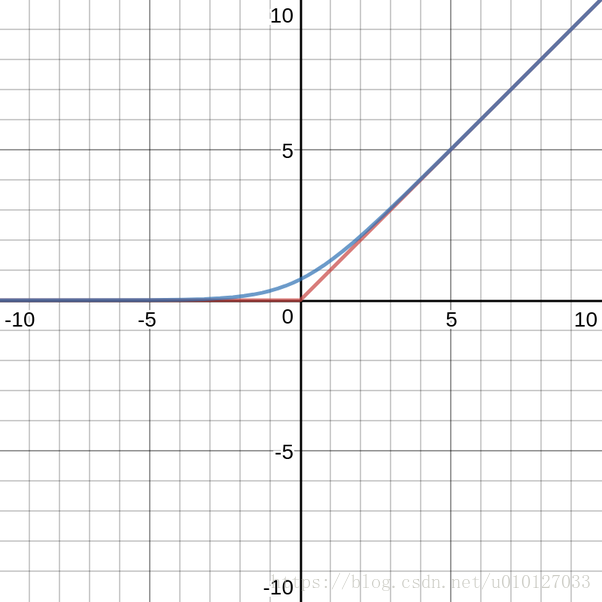

# ResNet 学习笔记

## 论文主要内容

1. 工具及工具的使用环境配置
2. 学科背景
3. 语言(相关学习途径)
4. 引用/致谢

## 小数据集应对过拟合的方法

1. 每个 *fold* (折,即对整个图像集的一轮训练) 开始训练之前
   * 有概率进行AffineTransformation(即仿射变换,允许图像任意倾斜,任意伸缩)中的两种变换
      ( 排除了
      必须要进行的 ZoomTransformation (缩放变换) <为了适应网络入口> 和
      无扰动意义的TranslationTransformation (平移变换) ):

   * 有概率进行 RotationTransformation (旋转变换) , 旋转的角度在预设的范围内 (备选集范围为(-90,90)) 随机选取;

   * 有概率进行 ShearTransformation (剪切变换) , 剪切的角度在预设的范围内 (备选集范围为(-90,90)) 随机选取;

2. 每个 *fold* 开始训练之前
   * 有概率进行 ReflectionTransformation (反射变换) , 当参数设置为 ‘true’ 时 每次预处理对每一张图都有 50% 的概率进行反射变换, 即图像转变为其中心对称图形;

3. 实现方法在Options相关函数中可以设置;

## 附录1: 各类函数、关键字及其参数简介

### 通用关键字

1. *keyword* categorical / single
   * 使用类似categorical(< matrixName >) 的结构可以将matrix由原有类型强制转换为如categorical这样的另一类型;
   * 在本程序中使用该语法和zeros函数来为scores_t 和 predicted_labels 两个变量提供指定缓存区,防止在循环过程中使用链表为其分配动态内存导致不必要的计算资源占用;
2. *keyword* for  
   * 用于实现指定次数的循环操作;
   * e.g :  
      for indexName=values  
         statements;  
      end  
   * Note: indexName 是实时的循环序号;
   * Note: values 用于指定index的范围和变化算法,其形式可以是各种形式的矩阵(包括普通行向量,等差序列,n阶单位矩阵等);
      * e.g:  1:3;  
            1:-0.1:0;  
            [1 5 8 2];(指定循环中需要操作的时刻)  
            eye(1,2);单位阵  
            ...  
   * Note: statements 指每次循环中需要执行的语句;
3. *keyword* **:**  
   **:** 一共有以下几种常见用法;  
      * 创建向量(序列)  
         * 创建序列 J:K <=> J,J+1,J+2,...K-1,K  

         * 创建等差序列 J:I:K  

      * 数组(矩阵)下标(选取用)  
         * A(:,n),选取A 的第n列;  

         * A(m,:),选取A的第m行;  

         * A([ j:k ],[ a:b ]),选取A的j~k行中对应A中a~b列的内容;  

      * for loop 中的循环次数指定;(参见for的介绍)
4. *function* fopen  
   fileID = fopen(filename);
5. *function* fprintf  
   * format output function.  
   * fprintf([ fileID ],'strings and dataFormats',dataname1,dataname2,...);  
   * Note: 不指定fileID 时,用于将格式化的带数据字符串输出到stdout中(类似C语言中的printf)。  
   * Note: 指定fileID 时,用于将格式化的带数据字符串输出到fileID指向的文件中;  
6. *keyword* clear  
   * 用于清理变量;  
   * clear variableName01,vN02,...//清理指定  
   * clear all;// 清理所有;
7. *keyword* **@**
   * 用于创建函数句柄;(function handle creation)
   * Note: 这个概念其实是C语言里的 *函数指针* , *FILE* 关键字和 *#define* 预处理的混合概念;
   * 一般用法: f_represent = @'functionname';
   * 特殊用法(创建匿名函数,类似于宏函数):

         f_present = @( parameterName1,parameterName2,... )[ functionName( parameterName1,parameterName2,... ) or ( expression composed by parameters before ) ]
   * Note: 本文采用第二种用法重构了图像读取函数,使得程序可以兼容灰度图和RGB图(参见preprocess_Xray.m对应函数在程序中的应用);
8. *datatype* imageDatastore
   * *imageDatastore* 是这样一种类型,它只存储了文件的一些关键参数(因此可以被用于处理整体过大而个体可导入内存的数据集)而不是文件本身;
   * *subclass*
      * *files* 存储了对应数据集中各个文件的路径;
      * *AlternateFileSystemRoots* 备用文件根目录,用于并行处理和云处理;
      * *ReadSize* 每次调用读图函数时读取的图像数;
      * *Labels* 标签存储区;
      * *ReadFcn* 读图函数的声明;
9. *datatype* cell (array)
   * 中文名叫 *单元(阵列)*/*元胞(阵列)*;
   * 它的各个元胞可以不同(体现在*数据类型*和*数据大小*的任意性上);

### 数据处理阶段

1. *function* imageDatastore
   * 用于导入图像集;
   * e.g : imds = imageDatastore(< location > , 'parameterName01','value01',...);
   * Note: 使用imageDatastore 函数导入数据集的优势在于可以导入一个每个元素都可以导入内存但整个数据集不一定能导入内存的数据集，**这代表着数据集的使用不再受限于数据集整体的大小与内存的大小之间的关系，而仅仅受限于数据集中最大的元素的尺寸和内存的尺寸的大小关系。**
   * Note: 其实际是通过仅读取图像的绝对路径和文件头内的特征信息(大小,通道数等)而不是直接载入整个文件来实现的;
   * Note: 创建的对象类型为'ImageDatastore'(注意首字母大写);
   * *parameters*
      * 'IncludeSubfolders'  
         它只有true 和 false 两个值, 默认为 false,设定是否包含指定文件夹下的子文件夹内的内容;
      * ’FileExtension‘  
         它的参数可以为任意主流的图像文件的后缀名,有两种使用方法:
         * 只指定一种文件时,参数格式类似 '.jpg'(注意 _’.‘_ );
         * 指定多种格式时,参数格式类似 {'.jpg','.png',... }, 也即用大括号和逗号分别作为内外部元素之间与内部元素之间的间隔符;
      * ’AlternateFileSystemRoots‘  
         主要用于分布式计算,略;
      * ’Labelsource‘  
         用于指定各数据元素的标签来源;  
         * 默认为'none',也即不从数据集获取标签;(代表着标签需要操作者自己后续导入);
         * 可选为'foldernames',也即使用数据元素的所在文件夹名为其标签名;
2. *function* countEachLabel
   * 统计一个数据集中所有不同的标签名的数量;
   * e.g : labelnum = countEachLabel(imds);
   * Note : 其结果一般用于后续的网络层替换;
3. *function* length
   * 求输入矩阵中最大数组长度的维度;
   * e.g : L = length(X);
   * Note: 对于向量, 返回值就是向量的长度, 对于多维矩阵, 返回值是该矩阵中各向量长度间的最大值;
   * Note: 在本程序中该函数被用于求解标签集的长度,进而求得总的图像数量;
4. *function* randperm
   * random permulation;
   * 返回一个 乱序的序列,有两种用法 :
      * rn01 = randperm(n); % 返回一个包含1~n的乱序向量;
      * rn02 = randperm(n,m); % 返回一个元素为从1~n中选取的m个数的乱序向量;
5. *function* zeros/eye/ones/rand
   * 用于创建矩阵;
   * 返回一个全零/单位/全一/随机矩阵;
   * 它们一共有两种用法 :
      * buf01 = zeros(< size >,[ datatype ]);
      * buf02 = zeros('like',SampleMatrixName);
   * e.g : buf = zeros(4,2,'single');
   * *parameters*
      * < size > 参数有两种表达方法 :
         * [m n] , m 行 n 列;
         * m,n , m 行 n 列;
      * [ datatype ]
         |    种类 |                                  备注 |
         |--------:|--------------------------------------:|
         |  double |             64位双精度浮点数(default) |
         |    char |                              单个字符 |
         |  single |                      32位单精度浮点数 |
         |   uint8 |                         8位无符号整数 |
         |  uint16 |                        16位无符号整数 |
         |  uint32 |                        32位无符号整数 |
         |  uint64 |                        64位无符号整数 |
         |    int8 |                         8位有符号整数 |
         |   int16 |                        16位有符号整数 |
         |   int32 |                        32位有符号整数 |
         |   int64 |                        64位有符号整数 |
         | logical | 逻辑型变量, 只有 true 和 false 两种值 |
      * 'like',SampleMatrixName
         * 用于生成一个在大小和数据类型上与样例矩阵相同的矩阵;
   * Note: 参数种类 ’codist‘ 现阶段一般用不上(用于分布式计算),故上面没有记录, 其有 codistributor2dbc() 和 codistributor1d() 两个选项,用于指定矩阵分配方案;
   * Note: 参数种类 ’arraytype‘ 一般与codist 搭配使用,有‘distributed’和‘codistributed’两个选项, 故也不介绍;
6. *function* subset  
   * 用于从大数据集中提取指定序列的数据元素;  
   * e.g : mininset01 = subset(originsetName,seriesNumberMatrixName);  
7. *function* setdiff  
   * 用于求两个数组的元素种类差异;  
   * e.g : miniset02 = setdiff(A,B);  
   * Note: 在本次程序设计中用于求出总数据集中除了测试集之外的所有图像的序号(与subset搭配使用来组建训练集)  
8. *function* numel
   * 用于统计数组元素的数目;
   * e.g : num = numel(A);
9. *function* categories
   * 用于统计分类数组中的类别;
   * e.g : buf = categories(Labelsbuf);
   * 在本次程序设计中该函数用于获取标签的种类名;
10. e

### 网络重构阶段

1. *net* resnet50  
      * 用于导入resnet50网络(要求已经配置好该网络)  
      * e.g : net01 = resnet50;  
2. *function* layerGraph  
      * 用于提取输入的DAG ( Directed acyclic graph ) [ 有向无环图 ]型网络本身或者顺序网络的 Layers 参数 对应的的网络构型;  
      * 当无输入参数时,会创建一个空的网络构型对象容器;  
      * 对于DAGNetwork,直接使用 lgraphName = layerGraph(netName);  
      * 对于SeriesNetwork,需要使用 lgraphName = layerGraph(netName.Layers);  
      * 创建的 lgraphName 对象为 LayerGraph 类型(属性);
3. *function* fullyConnectedLayer
   * 用于创建一个新的全连接层;
   * e.g : new_fc_buf = fullyConnectedLayer(outputsize,...
                     'Name','new_fc',...
                     'parameterName01','namestring',...
                     ......);
   * *parameters*
      * **Outputsize**
         * 设置层的输出种类(一般对标需要分成的类别数);
      * Inputsize
         * 层的输入数, 一般使用'auto'即可(也是默认设置);
         * 如果需要,也可以设置为一个正整数;
      * WeightInitializer
         * 选择初始化权重参数的函数;
         * (default) 'glorot';(一种较有效的初始化神经网络的理论,别称 Xavier)
         * (optional) {
            'he';(未了解,后继者有兴趣欢迎补充)
            'orthogonal';(未了解,后继者有兴趣欢迎补充)
            'narrow-normal';(通过从均值=0 和标准差=0.01 的正态分布独立采样来初始化偏置)
            'zeros';(用全零矩阵初始化)
            'ones';(用全一矩阵初始化)
            other function handle;(还可以导入用户自建的初始化函数)
            }
      * BiasInitializer
         * 选择初始化偏置比例参数的函数;
         * (default) 'zeros';
         * (optiona){
            'ones';
            'narrow-normal';(通过从均值=0 和标准差=0.01 的正态分布独立采样来初始化偏置)
            other function handle;
         }
      * Weights
         * 本层权重的初始化值
         * (default) [];(也即空矩阵)
         * (optional) 自建的矩阵;
         * Note: 一般只有在待训练网络自身该参数为空时才会使用设置的值;
         * 待训练的参数之一;
      * Bias
         * 本层偏置的初始化值
         * (default) [];(也即空矩阵)
         * (optional) 自建的矩阵;
         * Note: 一般只有在待训练网络自身该参数为空时才会使用设置的值;
         * 待训练的参数之一;
      * **WeightLearnRateFactor**
         * 本层权重的学习步长相比于全局学习步长的倍数;
         * 应当为一个非负标量;
         * (default) 1;
         * (optional) 任意非负标量;
         * 程序运行时将会用改参数与全局学习步长参数相乘,作为该层的权重学习步长;(全局学习步长将会在trainingOptions函数使用时设置,见后文)
      * **BiasLearnRateFactor**
         * 层偏置的学习步长相比于全局学习步长的倍数;
         * 其他说明与 WeightLearnRateFactor 的相关说明一致,不赘述;
      * WeightL2Factor
         使用L2 regularization (L2正则化)时才可能需要使用这个参数,默认值为1,其余与上同,略;
      * BiasL2Factor
         与上说明类似,同略;
      * Name
         * 层的名称;
      * NumInputs
         * 输入流的数目(对于全连接层,该参数只能为1);
      * InputNames
         * 输入流的名称(对于全连接层,该参数默认为'in');
      * NumOutputs
         *输出流的数目(默认为1, 不可更改)
      * OutputNames
         *输出流的名称(对于全连接层,该参数默认为'out');
4. *function* softmaxLayer
   * 创建一个归一化指数函数层(用于将全连接层的输出转化为概率);
   * e.g : newsl = softmaxLayer('Name','newsoftmaxLayer');
   * 除了'NumInputs','InputNames','NumOutputs','OutputNames'这四个一般并不需要调整的参数之外,该类层没有其他参数;
   * 关于softmax函数,它和(hard)max函数的区别如下图  
   图中蓝线为softmax函数,红线为一般意义上的max函数;
   
5. *function* classificationLayer
   * 创建一个新的分类层,同时该类型层可作为整个网络的输出层;
   * e.g : new_cll = classificationLayer('Name','new_cll');
   * *parameters*
      * **Name**
         * 层名;
      * Classes
         * 分类类别;
         * *default* 'auto';
         * *optional*
            * categorical vector/string array/cell array of character vectors 这三种类型的变量;
6. *function* replaceLayer
   * 替换掉指定网络结构中的指定层并返回这个修改过的网络;
   * e.g : lgraph = replaceLayer(lgraph,'outputlayer_1000',new_cll);
   * *parameters*
      * **lgraph**
         * 旧网络的架构存储变量名(一般通过layerGraph函数读取,具体内容参见上文layerGraph函数介绍);
      * **layername**
         * 目标层在旧网络架构中的名称;
      * **larray**
         * 用于取代原层的新层;
      * mode
         * 重构网络的方式
         * (default) 'name';(依据原网络中与旧层连接的层的名字重新建立新网络与这些层的连接,也即复制旧层与网络的连接方式)
         * (optional) 'order';(依据新层自身内部的数组元素顺序决定旧层的输入层和输出层与新层的连接顺序,也即使用新层的连接设定)
         * Note: 一般不用修改,直接使用默认值即可;

### 训练阶段

#### 训练参数设置阶段

1. *function* trainingoptions

## 附录2: resnet-50 层说明

   177x1 Layer array with layers:

      1   'input_1'                      Image Input             224x224x3 images with 'zerocenter' normalization
      2   'conv1'                        Convolution             64 7x7x3 convolutions with stride [2  2] and padding [3  3  3  3]
      3   'bn_conv1'                     Batch Normalization     Batch normalization with 64 channels
      4   'activation_1_relu'            ReLU                    ReLU
      5   'max_pooling2d_1'              Max Pooling             3x3 max pooling with stride [2  2] and padding [0  0  0  0]
      6   'res2a_branch2a'               Convolution             64 1x1x64 convolutions with stride [1  1] and padding [0  0  0  0]
      7   'bn2a_branch2a'                Batch Normalization     Batch normalization with 64 channels
      8   'activation_2_relu'            ReLU                    ReLU
      9   'res2a_branch2b'               Convolution             64 3x3x64 convolutions with stride [1  1] and padding 'same'
      10   'bn2a_branch2b'                Batch Normalization     Batch normalization with 64 channels
      11   'activation_3_relu'            ReLU                    ReLU
      12   'res2a_branch2c'               Convolution             256 1x1x64 convolutions with stride [1  1] and padding [0  0  0  0]
      13   'res2a_branch1'                Convolution             256 1x1x64 convolutions with stride [1  1] and padding [0  0  0  0]
      14   'bn2a_branch2c'                Batch Normalization     Batch normalization with 256 channels
      15   'bn2a_branch1'                 Batch Normalization     Batch normalization with 256 channels
      16   'add_1'                        Addition                Element-wise addition of 2 inputs
      17   'activation_4_relu'            ReLU                    ReLU
      18   'res2b_branch2a'               Convolution             64 1x1x256 convolutions with stride [1  1] and padding [0  0  0  0]
      19   'bn2b_branch2a'                Batch Normalization     Batch normalization with 64 channels
      20   'activation_5_relu'            ReLU                    ReLU
      21   'res2b_branch2b'               Convolution             64 3x3x64 convolutions with stride [1  1] and padding 'same'
      22   'bn2b_branch2b'                Batch Normalization     Batch normalization with 64 channels
      23   'activation_6_relu'            ReLU                    ReLU
      24   'res2b_branch2c'               Convolution             256 1x1x64 convolutions with stride [1  1] and padding [0  0  0  0]
      25   'bn2b_branch2c'                Batch Normalization     Batch normalization with 256 channels
      26   'add_2'                        Addition                Element-wise addition of 2 inputs
      27   'activation_7_relu'            ReLU                    ReLU
      28   'res2c_branch2a'               Convolution             64 1x1x256 convolutions with stride [1  1] and padding [0  0  0  0]
      29   'bn2c_branch2a'                Batch Normalization     Batch normalization with 64 channels
      30   'activation_8_relu'            ReLU                    ReLU
      31   'res2c_branch2b'               Convolution             64 3x3x64 convolutions with stride [1  1] and padding 'same'
      32   'bn2c_branch2b'                Batch Normalization     Batch normalization with 64 channels
      33   'activation_9_relu'            ReLU                    ReLU
      34   'res2c_branch2c'               Convolution             256 1x1x64 convolutions with stride [1  1] and padding [0  0  0  0]
      35   'bn2c_branch2c'                Batch Normalization     Batch normalization with 256 channels
      36   'add_3'                        Addition                Element-wise addition of 2 inputs
      37   'activation_10_relu'           ReLU                    ReLU
      38   'res3a_branch2a'               Convolution             128 1x1x256 convolutions with stride [2  2] and padding [0  0  0  0]
      39   'bn3a_branch2a'                Batch Normalization     Batch normalization with 128 channels
      40   'activation_11_relu'           ReLU                    ReLU
      41   'res3a_branch2b'               Convolution             128 3x3x128 convolutions with stride [1  1] and padding 'same'
      42   'bn3a_branch2b'                Batch Normalization     Batch normalization with 128 channels
      43   'activation_12_relu'           ReLU                    ReLU
      44   'res3a_branch2c'               Convolution             512 1x1x128 convolutions with stride [1  1] and padding [0  0  0  0]
      45   'res3a_branch1'                Convolution             512 1x1x256 convolutions with stride [2  2] and padding [0  0  0  0]
      46   'bn3a_branch2c'                Batch Normalization     Batch normalization with 512 channels
      47   'bn3a_branch1'                 Batch Normalization     Batch normalization with 512 channels
      48   'add_4'                        Addition                Element-wise addition of 2 inputs
      49   'activation_13_relu'           ReLU                    ReLU
      50   'res3b_branch2a'               Convolution             128 1x1x512 convolutions with stride [1  1] and padding [0  0  0  0]
      51   'bn3b_branch2a'                Batch Normalization     Batch normalization with 128 channels
      52   'activation_14_relu'           ReLU                    ReLU
      53   'res3b_branch2b'               Convolution             128 3x3x128 convolutions with stride [1  1] and padding 'same'
      54   'bn3b_branch2b'                Batch Normalization     Batch normalization with 128 channels
      55   'activation_15_relu'           ReLU                    ReLU
      56   'res3b_branch2c'               Convolution             512 1x1x128 convolutions with stride [1  1] and padding [0  0  0  0]
      57   'bn3b_branch2c'                Batch Normalization     Batch normalization with 512 channels
      58   'add_5'                        Addition                Element-wise addition of 2 inputs
      59   'activation_16_relu'           ReLU                    ReLU
      60   'res3c_branch2a'               Convolution             128 1x1x512 convolutions with stride [1  1] and padding [0  0  0  0]
      61   'bn3c_branch2a'                Batch Normalization     Batch normalization with 128 channels
      62   'activation_17_relu'           ReLU                    ReLU
      63   'res3c_branch2b'               Convolution             128 3x3x128 convolutions with stride [1  1] and padding 'same'
      64   'bn3c_branch2b'                Batch Normalization     Batch normalization with 128 channels
      65   'activation_18_relu'           ReLU                    ReLU
      66   'res3c_branch2c'               Convolution             512 1x1x128 convolutions with stride [1  1] and padding [0  0  0  0]
      67   'bn3c_branch2c'                Batch Normalization     Batch normalization with 512 channels
      68   'add_6'                        Addition                Element-wise addition of 2 inputs
      69   'activation_19_relu'           ReLU                    ReLU
      70   'res3d_branch2a'               Convolution             128 1x1x512 convolutions with stride [1  1] and padding [0  0  0  0]
      71   'bn3d_branch2a'                Batch Normalization     Batch normalization with 128 channels
      72   'activation_20_relu'           ReLU                    ReLU
      73   'res3d_branch2b'               Convolution             128 3x3x128 convolutions with stride [1  1] and padding 'same'
      74   'bn3d_branch2b'                Batch Normalization     Batch normalization with 128 channels
      75   'activation_21_relu'           ReLU                    ReLU
      76   'res3d_branch2c'               Convolution             512 1x1x128 convolutions with stride [1  1] and padding [0  0  0  0]
      77   'bn3d_branch2c'                Batch Normalization     Batch normalization with 512 channels
      78   'add_7'                        Addition                Element-wise addition of 2 inputs
      79   'activation_22_relu'           ReLU                    ReLU
      80   'res4a_branch2a'               Convolution             256 1x1x512 convolutions with stride [2  2] and padding [0  0  0  0]
      81   'bn4a_branch2a'                Batch Normalization     Batch normalization with 256 channels
      82   'activation_23_relu'           ReLU                    ReLU
      83   'res4a_branch2b'               Convolution             256 3x3x256 convolutions with stride [1  1] and padding 'same'
      84   'bn4a_branch2b'                Batch Normalization     Batch normalization with 256 channels
      85   'activation_24_relu'           ReLU                    ReLU
      86   'res4a_branch2c'               Convolution             1024 1x1x256 convolutions with stride [1  1] and padding [0  0  0  0]
      87   'res4a_branch1'                Convolution             1024 1x1x512 convolutions with stride [2  2] and padding [0  0  0  0]
      88   'bn4a_branch2c'                Batch Normalization     Batch normalization with 1024 channels
      89   'bn4a_branch1'                 Batch Normalization     Batch normalization with 1024 channels
      90   'add_8'                        Addition                Element-wise addition of 2 inputs
      91   'activation_25_relu'           ReLU                    ReLU
      92   'res4b_branch2a'               Convolution             256 1x1x1024 convolutions with stride [1  1] and padding [0  0  0  0]
      93   'bn4b_branch2a'                Batch Normalization     Batch normalization with 256 channels
      94   'activation_26_relu'           ReLU                    ReLU
      95   'res4b_branch2b'               Convolution             256 3x3x256 convolutions with stride [1  1] and padding 'same'
      96   'bn4b_branch2b'                Batch Normalization     Batch normalization with 256 channels
      97   'activation_27_relu'           ReLU                    ReLU
      98   'res4b_branch2c'               Convolution             1024 1x1x256 convolutions with stride [1  1] and padding [0  0  0  0]
      99   'bn4b_branch2c'                Batch Normalization     Batch normalization with 1024 channels
      100   'add_9'                        Addition                Element-wise addition of 2 inputs
      101   'activation_28_relu'           ReLU                    ReLU
      102   'res4c_branch2a'               Convolution             256 1x1x1024 convolutions with stride [1  1] and padding [0  0  0  0]
      103   'bn4c_branch2a'                Batch Normalization     Batch normalization with 256 channels
      104   'activation_29_relu'           ReLU                    ReLU
      105   'res4c_branch2b'               Convolution             256 3x3x256 convolutions with stride [1  1] and padding 'same'
      106   'bn4c_branch2b'                Batch Normalization     Batch normalization with 256 channels
      107   'activation_30_relu'           ReLU                    ReLU
      108   'res4c_branch2c'               Convolution             1024 1x1x256 convolutions with stride [1  1] and padding [0  0  0  0]
      109   'bn4c_branch2c'                Batch Normalization     Batch normalization with 1024 channels
      110   'add_10'                       Addition                Element-wise addition of 2 inputs
      111   'activation_31_relu'           ReLU                    ReLU
      112   'res4d_branch2a'               Convolution             256 1x1x1024 convolutions with stride [1  1] and padding [0  0  0  0]
      113   'bn4d_branch2a'                Batch Normalization     Batch normalization with 256 channels
      114   'activation_32_relu'           ReLU                    ReLU
      115   'res4d_branch2b'               Convolution             256 3x3x256 convolutions with stride [1  1] and padding 'same'
      116   'bn4d_branch2b'                Batch Normalization     Batch normalization with 256 channels
      117   'activation_33_relu'           ReLU                    ReLU
      118   'res4d_branch2c'               Convolution             1024 1x1x256 convolutions with stride [1  1] and padding [0  0  0  0]
      119   'bn4d_branch2c'                Batch Normalization     Batch normalization with 1024 channels
      120   'add_11'                       Addition                Element-wise addition of 2 inputs
      121   'activation_34_relu'           ReLU                    ReLU
      122   'res4e_branch2a'               Convolution             256 1x1x1024 convolutions with stride [1  1] and padding [0  0  0  0]
      123   'bn4e_branch2a'                Batch Normalization     Batch normalization with 256 channels
      124   'activation_35_relu'           ReLU                    ReLU
      125   'res4e_branch2b'               Convolution             256 3x3x256 convolutions with stride [1  1] and padding 'same'
      126   'bn4e_branch2b'                Batch Normalization     Batch normalization with 256 channels
      127   'activation_36_relu'           ReLU                    ReLU
      128   'res4e_branch2c'               Convolution             1024 1x1x256 convolutions with stride [1  1] and padding [0  0  0  0]
      129   'bn4e_branch2c'                Batch Normalization     Batch normalization with 1024 channels
      130   'add_12'                       Addition                Element-wise addition of 2 inputs
      131   'activation_37_relu'           ReLU                    ReLU
      132   'res4f_branch2a'               Convolution             256 1x1x1024 convolutions with stride [1  1] and padding [0  0  0  0]
      133   'bn4f_branch2a'                Batch Normalization     Batch normalization with 256 channels
      134   'activation_38_relu'           ReLU                    ReLU
      135   'res4f_branch2b'               Convolution             256 3x3x256 convolutions with stride [1  1] and padding 'same'
      136   'bn4f_branch2b'                Batch Normalization     Batch normalization with 256 channels
      137   'activation_39_relu'           ReLU                    ReLU
      138   'res4f_branch2c'               Convolution             1024 1x1x256 convolutions with stride [1  1] and padding [0  0  0  0]
      139   'bn4f_branch2c'                Batch Normalization     Batch normalization with 1024 channels
      140   'add_13'                       Addition                Element-wise addition of 2 inputs
      141   'activation_40_relu'           ReLU                    ReLU
      142   'res5a_branch2a'               Convolution             512 1x1x1024 convolutions with stride [2  2] and padding [0  0  0  0]
      143   'bn5a_branch2a'                Batch Normalization     Batch normalization with 512 channels
      144   'activation_41_relu'           ReLU                    ReLU
      145   'res5a_branch2b'               Convolution             512 3x3x512 convolutions with stride [1  1] and padding 'same'
      146   'bn5a_branch2b'                Batch Normalization     Batch normalization with 512 channels
      147   'activation_42_relu'           ReLU                    ReLU
      148   'res5a_branch2c'               Convolution             2048 1x1x512 convolutions with stride [1  1] and padding [0  0  0  0]
      149   'res5a_branch1'                Convolution             2048 1x1x1024 convolutions with stride [2  2] and padding [0  0  0  0]
      150   'bn5a_branch2c'                Batch Normalization     Batch normalization with 2048 channels
      151   'bn5a_branch1'                 Batch Normalization     Batch normalization with 2048 channels
      152   'add_14'                       Addition                Element-wise addition of 2 inputs
      153   'activation_43_relu'           ReLU                    ReLU
      154   'res5b_branch2a'               Convolution             512 1x1x2048 convolutions with stride [1  1] and padding [0  0  0  0]
      155   'bn5b_branch2a'                Batch Normalization     Batch normalization with 512 channels
      156   'activation_44_relu'           ReLU                    ReLU
      157   'res5b_branch2b'               Convolution             512 3x3x512 convolutions with stride [1  1] and padding 'same'
      158   'bn5b_branch2b'                Batch Normalization     Batch normalization with 512 channels
      159   'activation_45_relu'           ReLU                    ReLU
      160   'res5b_branch2c'               Convolution             2048 1x1x512 convolutions with stride [1  1] and padding [0  0  0  0]
      161   'bn5b_branch2c'                Batch Normalization     Batch normalization with 2048 channels
      162   'add_15'                       Addition                Element-wise addition of 2 inputs
      163   'activation_46_relu'           ReLU                    ReLU
      164   'res5c_branch2a'               Convolution             512 1x1x2048 convolutions with stride [1  1] and padding [0  0  0  0]
      165   'bn5c_branch2a'                Batch Normalization     Batch normalization with 512 channels
      166   'activation_47_relu'           ReLU                    ReLU
      167   'res5c_branch2b'               Convolution             512 3x3x512 convolutions with stride [1  1] and padding 'same'
      168   'bn5c_branch2b'                Batch Normalization     Batch normalization with 512 channels
      169   'activation_48_relu'           ReLU                    ReLU
      170   'res5c_branch2c'               Convolution             2048 1x1x512 convolutions with stride [1  1] and padding [0  0  0  0]
      171   'bn5c_branch2c'                Batch Normalization     Batch normalization with 2048 channels
      172   'add_16'                       Addition                Element-wise addition of 2 inputs
      173   'activation_49_relu'           ReLU                    ReLU
      174   'avg_pool'                     Average Pooling         7x7 average pooling with stride [7  7] and padding [0  0  0  0]
      175   'fc1000'                       Fully Connected         1000 fully connected layer
      176   'fc1000_softmax'               Softmax                 softmax
      177   'ClassificationLayer_fc1000'   Classification Output   crossentropyex with 'tench' and 999 other classes
