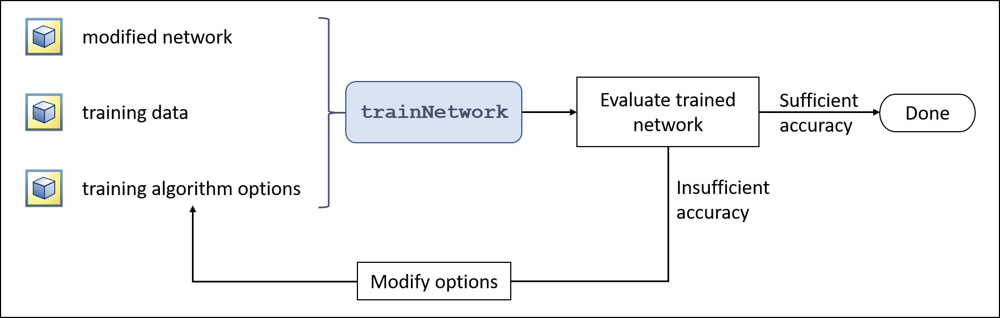

# MATLAB Learning Note

## 1. try to use images

1. Use **I = imread("filelink");** to import files into variable I;

2. use **imshow(I)** to show images in I;

## 2. try to use Alexnet

1. use **net = alexnet** to import alexnet into variable net;

2. use **pred1 = classify(netname,imagename)** to predict the image's label and save it in pred1;

3. use **ly = alexnet.Layers** to assign alexnet's layer-messages to variable ly;

4. use **buf = ly(layernumber)** to call specified layer's property;

5. use **subbuf1 = buf.parametername** to call specified layer's sub-property;
    tip : use deepnet = alexnet;deepnet.Layers(1).Inputsize can now that the Alexnet's input image size is "227* 227 *3"
    be careful of the command's case;

6. use **categorynames = ly(25).Classes** to call the network's categories;
    tip : the classes property of the outputlayer gives the names of the categories the network is trained to predict;
7. use **[ predict,scores ] = classify(netname,imagename)** to call the probability that this net give for this image responding to each class;
    tip : we can use _scores_ vector's value to investigate this net,we can use **bar(scores)** to see the bar chart of them;
          we can use a logical value vector to optimize the bar chart,make it only show more significant classes;
          indeedly , it means use **highscores = scores>0.01** to filtrate the classes who's score is larger than 0.01;(the parameter 0.01 is called _threshold criteria_<门槛标准>, generally , we use _value = std(scores) + median(scores)_ to be the threshold criteria)
          then use **bar(scores(highscores))** to show the more useful bar chart;
          finally , use **xticklabels(categorynames(highscores))** to give them right labels;
          additionally , we can use the following code to show the labels more graceful.

                xticklabels(categorynames(highscores))
                xticks(1:length(scores(highscores)))
                xtickangle(60)

## Try to compute multiple files

1. Datastore data structure

* use **imds = imageDatastore("filename.fileextension")** can import a folder that include several images and prevent directly load them;
tip: use wildcard characters such as _*_ or _?_ can reduce the input word numbers;

* use **fname = imds.Files** can call the absolute location of files in this datastore;

* use **I1 = readimage(imds,image-serial-number);** can load a single special image in variable I;

* use **I2 = readall(imds)** load all the images into an array called I2,each image has a separate cell;

* we can use an imagedatastore structure replace a single image in any CNN functions (such as classify) to batch process them;
  of course the return value are arrays , each row vector corresponding to an image.

tip : use **I = arrayname(1,:)** can obtain a row vector from an array;

## Try to manage images in Visual interface

1. tool_ImageBrowser

we can use ImageBrowser to explore all the images in spcial folder quickly and get their properties;
tip : use _image viewer_ plugin in the tool can see more details such as gray bar and resize or cut the images;

## preprocess images

1. we can use **img = imresize(img,[ heightnum,widthnum ])** to resize single img;

2. of course , the batch processing is more commonly , so the more useful method is use bulit-in function;

* use **auds = augmentedImageDatastore([ heightnum,widthnum ],ImageDatastoreName)** can batch simple preprocess images in the datastore;

## try to manage grayscale images

1. use **montage(imds)** can show several images in one image;

2. use **auds = augmentedImageDatastore([ height,width],imds,'ColorPreprocessing','gray2rgb')** to tranform grayscale images to be rgb images
when preprocess images;

## try to manage images in folders tree

1. use 

        flowerf = imageDatastore('rootfoldername',
        'IncludeSubfolders',true)

    to include all the images in the rootfolder;

## try to know transfer learning

1. Why we should do transfer learning ?
beacause do CNN designment from scratch will have three requestment:

    * problems

    1. knowledge and experience with network architecture,

    2. a huge amount of training data,

    3. a lot of computer time.

2. How to prepare for transfer learning in MATLAB ?

    * the required components of start a transfer learning

        1. Completed Trained Network layers;

        2. trianing datas with correct labels;

        3. Alogrithm options;

    * core function : newnet = trainNetwork(data,layers,options);

    * Typical workflow for transfer learning
    

    * how to import labels from folders' name ?

        flowerf = imageDatastore('rootfoldername',
        'IncludeSubfolders',true,
        'LabelSource','foldernames');

    * how to read a datastore's labels?

        labelbuf = flowerf.Labels;
    of course you can also assign the Labels property by a categorical array of image labels.

    * how to split dataset to be divide training dataset and testing dataset?

    the test dataset only is used to test if the network is enough accuracy.

    use function **[ ds1,ds2 ]splitEachLabel(imds,_p_)** to split each label's images into
    test dataset and training dataset by the weight of _p_ **( p/1 's images will be split to ds1,and the others will be give ds2)**,in other word ,the _p_ parameter is interpreted as a proportion;  

    note: the proportion _p_ should in the section between _0~1_;  

    additionally , we can use parameter _'randomized'_ to random the sequence of split;  
    example: [ ds1,ds2 ]splitEachLabel(imds,_p_,'randomized');  

    note: if the p parameter is **larger than 1** , it will be interpreted be **the least value of the image-number in ds1**;

## The structure of network

1. the input layer
    * ???

2. convolution layer pooling layer and ReLU layer  
    * ??????? ? ???????
    * they take the original input image and extract various features that can then be used for classification.

3. the fully connected layer  
    * ????
    * notice that the 23th layer in alexnet is a fully connected layer with 1000 neurons,it takes the features from
    the previous layers and maps(??) them to the 1000 output classes.

4. the softmax layer
    * softmax?(????)
    * in alexnet it's serial number is 24;

    * this layer turns the raw values for the 1000 classes into normalized scores
    so that each value can be interpreted as the network's prediction of the probability that the image belongs to that class.

5. the output layer

    * ???
    * in alexnet it's serial number is 25 (the last layer);

    * this layer get the previous probabilities and return the most
    likely class as the network's output.

## how to do transfer learning in MATLAB by redesigning alexnet

### the basic alogrithm

1. delete the last 3 layers in alexnet and replace them with corresponding new layers.

    * it means the modified network has the same feature extraction behavior as the pretrained network (in this situation , it is the alexnet),
    but hasn't yet been trained to map these features to image classes;

2. use new presigned dataset run the newset modified network , so  the network will extract features and refine them to be more slightly to the specially application.

### the realization

#### modify fully connected layer

1. use **fclayer = fullyConnectedLayer(neuron_num)** to create a fully connected layer with specified neuron number.

2. use **layers(23) = fclayer** represent the alexnet's 23th fully connected layer.(default setting is net = alexnet;layers = net.Layers; have done)

#### modify output layer

1. use **layers(25) = classificationLayer** to replace the output layer with a blank output layer , the classes in the output layer will be determined in the process of learning .

#### call the options for a chosen training alogrithm

1. use **opts = trainingOptions('alg_name')** to call the options list;
    * example: opts = trainingOptions('sgdm');

2. use **opts = trainingOptions('alg_name','InitialLearnRate',0.001)** to reduce the length of gradient descent.(the default value is 0.01 ,which is too large for transfer learning)

#### features interpreting

1. accuracy value
    * it represents the percentage of the training images that the network classifies correctly , it should be increasing during the training.

    * note: the accuracy doesn't measure the confidence.

2. loss value
    * it represents how far from a perfect prediction to the real network prediction , of course , it also only be effective to the training set.

    * it should be decrease to zero during the training process.

3. the ideal situation

    * the accuracy value has attached the plateau of itself(in other word , 100%) but the loss value still is decreasing.

    * it means that the network still getting better at diffrentiating between the categories even if the final predictions may not be changing.

    * use second parameter info to get the processing accuracy value and loss value is workable , the code is here:  
    **[ newnet,info] = trainnetwork(data,layers,options)

#### the training details

1. mini-batch(??) iteration(????) and one epoch(??)
    * in each iteration , we use different batch of training data,it is called 'mini-batch';

    * when the whole training dataset has been used ,the process is called 'complete one epoch'

    * the maximum number of epochs(_MaxEpochs_) and the size of the mini-batches(_MiniBatchSize_) can be setted , they are all in the training alogrithm options.

    * the images will be shuffled once prior to being divided into mini-batches ,use _shuffle_ option can change it.

2. about GPU
    * if the computer has been installed Parallel Computing Toolbox for an appropriate GPU , _trainNetwork_ function will automatically use it.

#### an example

    % Get training images

    flower_ds = imageDatastore('Flowers','IncludeSubfolders',true,'LabelSource','foldernames');
    [trainImgs,testImgs] = splitEachLabel(flower_ds,0.6);
    numClasses = numel(categories(flower_ds.Labels));
    

    % Create a network by modifying AlexNet

    net = alexnet;
    layers = net.Layers;
    layers(end-2) = fullyConnectedLayer(numClasses);
    layers(end) = classificationLayer;
    

    % Set training algorithm options

    options = trainingOptions('sgdm','InitialLearnRate', 0.001);
    

    % Perform training

    [flowernet,info] = trainNetwork(trainImgs, layers, options);
    

    % Use trained network to classify test images

    testpreds = classify(flowernet,testImgs);

### how to evaluate the trained network

1. plot accuracy value and loss value

    * use **plot(info.Accuracy);plot(info.TrainingInfo);** to plot them;

2. use **numequal = nnz(a == b)** compare preclassification Labels and predict Labels.

3. use **confusionchart(correctLabels,predictLabels)** can plot the right-wrong matrix which is useful for find special plot variables that can't be correct recognized.
(xaxis is preclassified labels and yaxis is predicted labels)

### how to improve the network

core : change the three kernel-elements (dataset,Network and Training Alogrithm Options)

1. the first part need to change is Training Alogrithm Options.

    * Learning rate and momentum
        * they are the key options for update weights.

        * the goal of training is to minimize the loss function , which is the measure of how badly the network performs on the training data.
        it just like the height between you and the buttom when you are going downhill.

        * we use gradient descent alogrithm to find the lowest height place around you and try to walk toward that direction.

        * the learning rate just like the length of your steps, so if the learning rate is too large you will jump around the buttom , so if your network not work ,try to divide your learning rate by 10 and try again;

        * the momentum just like the straight degree of your direction change behavior , you can directly turn to that direction , but you can also just _slightly toward_ that direction , the momentum option is the degree you turn to the new direction , the new direction will be determined by the weighted average of the previous direction and the 'right direction' , that weighting is set by momentum .
        it is used to slove the probem called 'over fitting' , it means the network works well on training dataset but can't accurately recognize the test dataset (the reason of this problem is the network learning more about the training dataset's detail than the general patterns).

        we can use **valitation data** to find this problem in the processing.
        it's corresponding options is _ValitaionData_ _ValitationFrequency_ and _ValitationPatience_.

