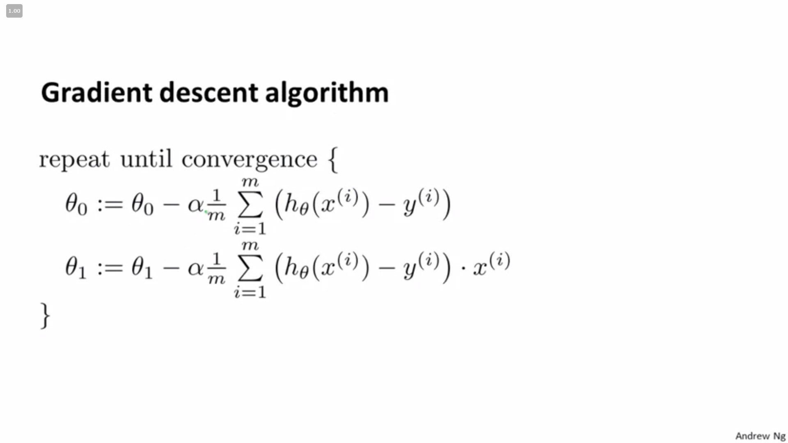

# Stanford Machine learning tutorial

## TEP

* T equals Task;
* E equals Experience;
* P equals performance.

## generally used machine learning alogrithm classifications

* supervised learning  
* unsupervised learning

## Supervised learning

The term Supervised Learning refers to the fact that we gave the algorithm a data set in which "right answers" were given.  

* it can be used to solve a kind of problems which is called *"regression problem"*,we try to predict *continuous* valued output by solve them;
* it also can be used to solve a kind of problems which is called *"classification problem"*,we try to predict *discrete* valued output by solve them;  
* all of them can have one or more features or attributes.
* when we want to use "infinite numbers of features and attributes" in supervised learning or other machine learning processing,  
  we need a tool called "support vector machine".

## unsupervised learning

divide dataset into several clusters without any prompt or , in other word,find the structure of dataset without any tips;

* it allows us to try to solve problems with no or little idea what our results should look like;
* it also allows us to derive structures from data where we don't necessarily know the effect of the variables.
* we can cluster dataset by this alogrithm based on the relationships among variables in the data;
* there is no feedback based on the prediction results if it used unsupervised learning.

## The key points to implement a supervised learning alogrithm

### linear regression

use 'right dataset' to *feed* the original learning alogrithm,and in the end, create a *hypothesis*(it means output a function maybe not very useful in the early days of machine learning,it is *the standard terminology*);

* in this environment,a pair of one input variable(can be denoted as x(i) ) and it's corresponding output(can be denoted as y(i) ) variable is called *a traing example*,they are linked by the serial number or the superscript *i*;
* a list of training examples is called *a training set*;
* the final target is training out a function like *h:X->Y*,X is the input dataset and Y is the output dataset,which is called *hypothesis*;
* when the predict price is continuous,the problem is called *regression problem*;
conversely, if it is discrete ,the problem is called *classification problem*.
* finally , if the input variable is univariate, the function will be like this 
**$$h_\theta(x)=\theta_0+\theta_1 x----------(1)$$**
this is called univariate linear regression,which will be emphatically discussed;

### cost function

the cost function is created to slove the problem "how to find the right parameters' value like *a* and *b* in univariate linear regression ?" or "how to measure the accuracy of the target hypothesis function?"

* **the most frequently used cost function in univariate linear regression** is *squared error cost function*,it is the sum of each pridict output value minus right output value , and then use the sum value divide 2 times of examples amount;
the formula just like this:
**$$J(\theta_0,\theta_1)=\frac{1}{2m}\sum_{i=1}^Nh_\theta(x^{(i)}-y^{(i)})^2----------(2)$$**
* In this environment, we find the appropriate parameters (exactly, a and b) to minimize the cost function's value then we can say we find the right parameters;
* by using **contour plots**,we can show the relationships between a,b and cost function's value;  
  

### gradient descent

it is an alogrithm to minimize the cost function with arbitrary number of parameters;

* it just like go downhill,from a random point to slowdown by numbers of baby steps until attach a local minimum;  
repeat this step,until the result is convergence.  
* the formula is here;  
**$\alpha$** is called "learning rate",it decide the length of move steps;

$$\theta_j := \theta_j - \alpha \frac{\partial}{\partial \theta_j} J(\theta_0, \theta_1)$$

* for learning , we should simultaneously(means realtime do sth) update the parameters(in this case , they are $\theta$0 and $\theta$1).
* the right and incorrect methods to update the parameters' values are here.

* the $\alpha$'s value is confirmed by designer;
  1. if it is too small, the calculating time will be very long;
  2. if it is too large, the model maybe can't be converge  or even will be diverge;
  
 the **converge** means the

 $$\theta_j := \theta_j - \alpha \frac{\partial}{\partial \theta_j} J(\theta_0, \theta_1)$$
 degenerates to be
$$\theta_j := \theta_j - \alpha *0$$
in other words,the partical derivative tends to be zero;

### gradient decsent in linear regression

we use cost function **$J(\theta_0,\theta_1)$** to link linear regression and gradient descent , we determine the value of $\theta_0$ and $\theta_1$ is useful or not by judging the cost function's output is close enough to zero or not , in other words , it is the **evaluation criterion**.

* formulas here are used to calculate **$\theta_0$ and $\theta_1$**;

* convex function
It's a bowl shaped function which don't have any local optimal instead the global optimum.
So wherever you start the linear regression's gradient descent , you will always converge to the same site.
this calculate process is called **batch gradient descent**,
It is worth pointing out that this alogrithm is a iterative alogrithm,it's cost is very large.
We can use other more advanced alogrithm if include advanced linear algebra.