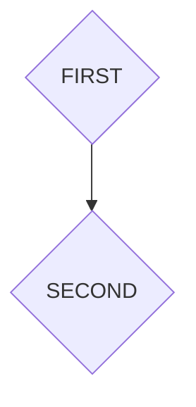
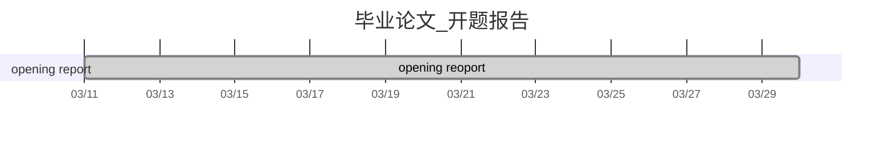
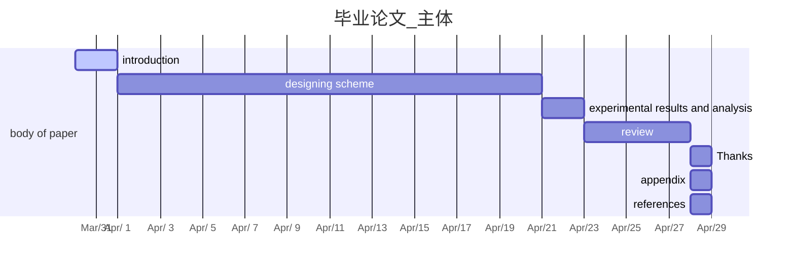

# flow chart

## the main flow chart

```mermaid
graph TB
A{FIRST} --> B{SECOND}
```

## the export flow chart

```mermaid
sequenceDiagram

```

## the time flow chart

```mermaid
gantt
dateFormat  YYYY-MM-DD
axisFormat  %m/%e
title 毕业论文_开题报告

section opening report
opening reoport :done, part_b , 2020-03-11,2020-03-30
```

```mermaid
gantt
dateFormat YYYY-MM-DD
axisFormat  %b/%e
title 毕业论文_主体

section body of paper
introduction                        :       active,part_1, 2020-03-30, 2d
designing scheme                    :       part_2, after part_1, 20d
experimental results and analysis   :       part_3, after part_2, 2d
review                              :       part_4, after part_3, 5d
Thanks                              :       part_5, after part_4, 1d
appendix                            :       part_6, after part_4, 1d
references                          :       part_7, after part_4, 1d
```
